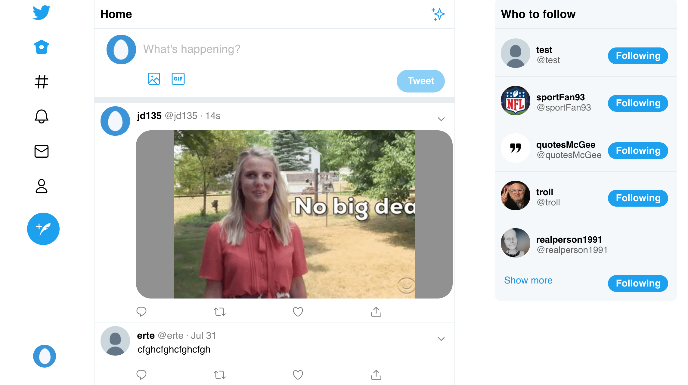

<h1 align="center">Twitter Clone</h1>

<h2 align="center"><a  href="https://afternoon-fjord-78280.herokuapp.com/home">Live Demo</a></h2>

  

## Description

A build of Twitter's core functionality from the ground up. Using Express/NodeJS for the back end, MongoDB for storing data, and ReactJS for client side views. Deployed on Heroku, using AWS S3 to save uploaded photos.

Final Project for [The Odin Project's Javascript Course](https://www.theodinproject.com/courses/javascript/lessons/final-project-116ff273-1e55-4055-bd7f-146c17d0ec9c).
